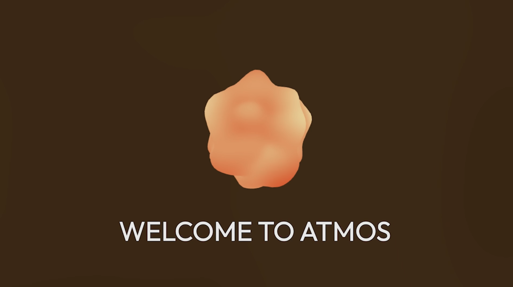

# Atmos

Synthesizing weather data into an immersive experience.

This prototype allows users to experience real-time weather in an immersive and artistic way—without showing any numbers. Instead, it translates weather data into visuals and sounds.

It was developed as my individual project for the 10-week IoT minor at the Amsterdam University of Applied Sciences, where I explored web technologies (Three.js, REST APIs, databases), embedded devices (ESP32, ESP8266, input/output sensors), and physical prototyping (laser cutting and hands-on fabrication).

## Watch the demo on Vimeo

[](https://vimeo.com/1075087574/c456319044)

## Documentation

- [Check out the Documentation](https://atmos.yanis.io)

## Getting Started

This project contains a setup using Docker. This will help you setup all the necessary tools to start developing your IoT project.
Before you run the docker-compose command, make sure you have to make changes to the configuration. You can find these in
the `.env` file.

Now, to install and start your project; run the following command in the root of your project:

```bash
docker-compose up -d
```

If everything runs correctly, you should be able to visit your website at [http://localhost/](http://localhost/).

## Structure

There is a specific structure that you should follow when developing your project. This will help you to keep your project organized and easy to understand.

**Documentation**

All the documentation of your project should be placed in the `docs/` folder. This will be used for your portfolio-website.

```bash
├── docs/
```

Run the following command to start your (local) Portfolio Website `mkdocs serve`.

**Embedded**

Everything you need to run your embedded application should be placed in the `embedded/` folder. This includes the source code like .ino-files from Arduino.

```bash
├── embedded/
```

**Web**

Everything you need to run your web application should be placed in the `web/` folder. This includes the source code like PHP, HTML, CSS, Javascript and images.

```bash
├── web/
```

You can visit your website by going to [http://localhost/](http://localhost/) in your browser. And you can find your IoT dashboard at [http://localhost/dashboard](http://localhost/dashboard).

## Database details

The database is a MySQL database using MariaDB. You can connect to it using the following details:

| Parameter | Value                                               |
| --------- | --------------------------------------------------- |
| Host      | `mariadb` (from PHP) `localhost` (from your laptop) |
| Port      | `3306`                                              |
| Username  | `root`                                              |
| Password  | You can find this in your .env-file.                |
| Database  | You need to create the database yourself.           |
