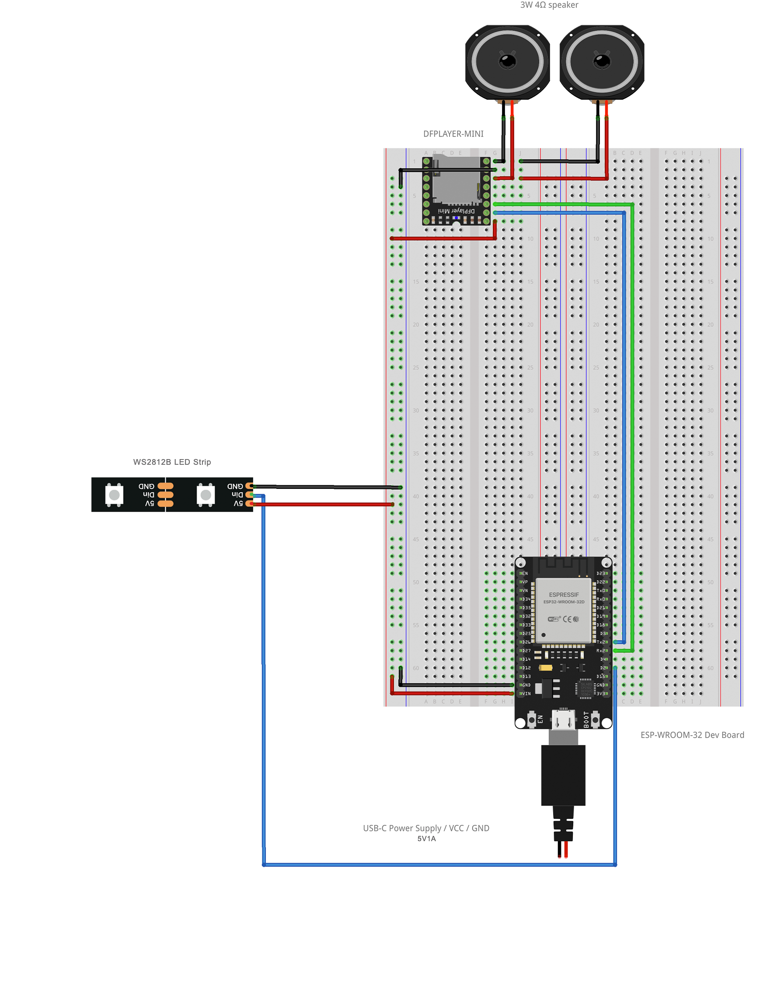
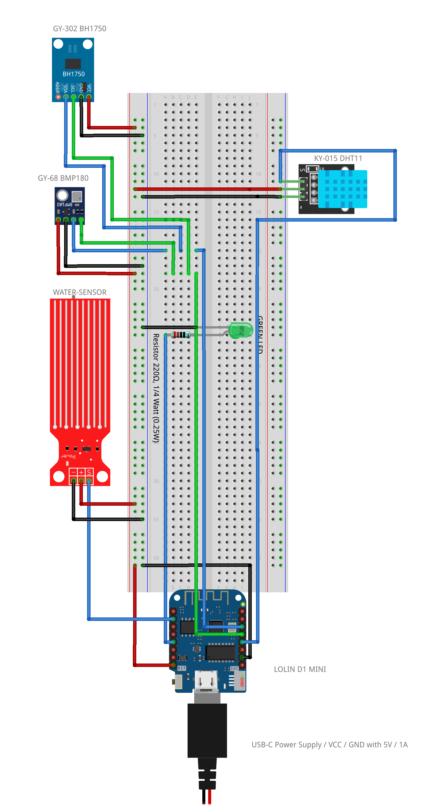

# Technical documentation

## Wiring Diagram

The wiring diagram is a visual representation of the electrical connections between components in the system.
It showcaces how power, datalines and modules are connected can help for replication.

### Installation

Core installation, which includes a central ESP32 and output modules (LED strips and audio playback).

### Sensors

Dedicated Sensor reader, which includes a WEMOS and input modules (temperature, light, humidity and air pressure) aswell as an LED Output.

This is the compact version which is currently used on a small breadboard. (No powerlines)

.png>)

### KiCad

## Bill of Materials

The Bill of Materials provides a detailed breakdown of the components used in this project.
It showcaces different details on the individual modules and can help for replication.

| Part #                 | Manufacturer       | Description                                             | Qty | Unit Price (incl. VAT) | Subtotal (incl. VAT) | Tolerance                 | MTBF        | Product URL                                                                     | Datasheet URL                                                                                                                                           |
| ---------------------- | ------------------ | ------------------------------------------------------- | --- | ---------------------- | -------------------- | ------------------------- | ----------- | ------------------------------------------------------------------------------- | ------------------------------------------------------------------------------------------------------------------------------------------------------- |
| ESP-WROOM-32 Dev Board | ELEGOO             | ESP32 WiFi/BLE Dev Board with USB Type-C                | 1   | €9.00                  | €9.00                | ±5% (I/O spec)            | ~1,000,000h | [Product](https://amzn.eu/d/1YMyH0u)                                            | [Datasheet](https://www.espressif.com/sites/default/files/documentation/esp32-wroom-32_datasheet_en.pdf)                                                |
| WMD1MINIV4             | LOLIN              | Wemos D1 Mini V4 Compact ESP8266 WiFi Development Board | 1   | €5.67                  | €5.67                | ±5% (I/O spec)            | ~1,000,000h | [Product](https://nl.aliexpress.com/item/32529101036.html?gatewayAdapt=glo2nld) | [Datasheet](https://www.wemos.cc/en/latest/d1/d1_mini.html)                                                                                             |
| WATER-SENSOR           | OEM (DIYables)     | Analog water leak detector (Arduino/ESP compatible)     | 1   | €1.44                  | €1.44                | ±10% (analog range)       | N/A         | [Product](https://amzn.eu/d/26tePmK)                                            | [Datasheet](https://curtocircuito.com.br/datasheet/sensor/nivel_de_agua_analogico.pdf?srsltid=AfmBOooqoDdOsugtCBZMuwH1-oMSFLe7yYytfpSWvciED3F50GMmWCqd) |
| GY-302 BH1750          | OEM (Rohm Module)  | Digital light intensity sensor (lux)                    | 1   | €6.33                  | €6.33                | ±3%                       | ~100,000h   | [Product](https://amzn.eu/d/iquJguZ)                                            | [Datasheet](https://cdn.sparkfun.com/datasheets/Sensors/Light/BH1750.pdf)                                                                               |
| Micro SD Card 4GB      | Cloudisk           | Class 4 microSD storage card                            | 1   | €6.00                  | €6.00                | ±5% (voltage)             | ~500,000h   | [Product](https://amzn.eu/d/hMVhT2f)                                            | [Datasheet](https://www.sdcard.org/downloads/pls/simplified_specs/)                                                                                     |
| GY-68 BMP180           | OEM (Bosch Sensor) | Pressure & temperature sensor module                    | 1   | €1.83                  | €1.83                | ±1 hPa                    | ~200,000h   | [Product](https://amzn.eu/d/6iiimTO)                                            | [Datasheet](https://cdn-shop.adafruit.com/datasheets/BST-BMP180-DS000-09.pdf)                                                                           |
| WS2812B LED Strip      | OEM (Worldsemi)    | Individually addressable RGB LED strip (144 LEDs/m)     | 1m  | €12.00                 | €12.00               | ±10% (brightness binning) | ~50,000h    | [Product](https://amzn.eu/d/bbOjDeR)                                            | [Datasheet](https://cdn-shop.adafruit.com/datasheets/WS2812B.pdf)                                                                                       |
| DFPLAYER-MINI          | DFRobot            | MP3 player module with microSD input & speaker support  | 1   | €4.55                  | €4.55                | ±5%                       | ~100,000h   | [Product](https://amzn.eu/d/2WhzTEw)                                            | [Datasheet](https://wiki.dfrobot.com/DFPlayer_Mini_SKU_DFR0299)                                                                                         |
| Speaker                | OEM                | 3W 4Ω speaker for audio output                          | 2   | €4.50                  | €9.00                | ±5% (impedance)           | N/A         | [Product](https://amzn.eu/d/4V2sNB1)                                            | [Datasheet](https://www.electrokit.com/uploads/productfile/41005/41005_datasheet.pdf)                                                                   |
| KY-015 DHT11           | Keyes              | Temperature & humidity sensor module                    | 1   | €1.90                  | €1.90                | ±2°C / ±5% RH             | ~200,000h   | [Product](https://amzn.eu/d/7gZ3JpF)                                            | [Datasheet](https://cdn.sparkfun.com/datasheets/Sensors/Temperature/DHT11.pdf)                                                                          |
| LED-GREEN              | OEM (Kingbright)   | 5mm green LED (from pack of 50)                         | 1   | €0.06                  | €0.06                | ±20% (luminous flux)      | ~100,000h   | [Product](https://amzn.eu/d/4NFvCYh)                                            | [Datasheet](https://www.farnell.com/datasheets/2724776.pdf)                                                                                             |
| JUMPER-WIRE-40PCS      | OEM                | 20cm male/female jumper wires (3 x 40 pieces)           | 49  | €0.09                  | €4.41                | N/A                       | N/A         | [Product](https://amzn.eu/d/7afTDd8)                                            | [Datasheet](https://cdn-learn.adafruit.com/assets/assets/000/077/148/original/adafruit_products_jumperspecs.png?1661879119)                             |
| Mini BREADBOARD        | OEM                | 170-point solderless breadboard                         | 1   | €1.60                  | €1.60                | N/A                       | N/A         | [Product](https://amzn.eu/d/hOiSBih)                                            | [Datasheet](https://handsontec.com/dataspecs/accessory/Breadboard-Full.pdf)                                                                             |
| BREADBOARD-MB102       | OEM                | 830-point full-size solderless breadboard               | 2   | €2.40                  | €4.80                | N/A                       | N/A         | [Product](https://amzn.eu/d/dgZWfJT)                                            | [Datasheet](https://handsontec.com/dataspecs/accessory/Breadboard-Full.pdf)                                                                             |
| RES220OHM-1/4W         | OEM (UniOhm)       | 220Ω resistor ±1%, 0.25W (from 100 pcs pack)            | 1   | €0.05                  | €0.05                | ±1%                       | ~1,000,000h | [Product](https://amzn.eu/d/03ejJvN)                                            | [Datasheet](https://www.farnell.com/datasheets/2861122.pdf)                                                                                             |
| USB-C-CHARGER-5V1A     | MatauMahi          | USB-C charger cable for power banks and devices (5V/1A) | 2   | €7.99                  | €15.98               | ±5% (output voltage)      | N/A         | [Product](https://www.amazon.nl/dp/B0C7ZP855X)                                  | N/A                                                                                                                                                     |

> **Disclaimer:**  
> The Tolerance and MTBF values listed are approximations provided by ChatGPT which uses general component knowledge and public datasheets.  
> These values serve as a practical estimate and should be cross-checked with manufacturer specifications for critical designs.
