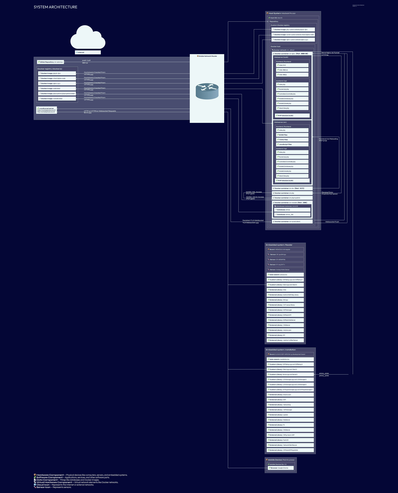

# System Architecture

## Introduction

This document provides an overview of the system structure, including hardware, software, databases, and network components.
It illustrates how these elements interact and communicate.

## System Architecture Diagram (SAD#01 - SAD#16)

[Open Image](https://atmos.yanis.io/assets/arch.png)

## Legend (SAD#05)

The following symbols are used in the diagram:

- **📦 Hardware Component** – Physical devices like computers, servers, and embedded systems.
- **🧩 Software Component** – Applications, services, and other software parts.
- **📄 Data Component** – Things like databases and Docker images.
- **📡 Virtual Hardware Component** – Virtual network elements like Docker networks.
- **🌐 Cloud Icon** – Represents the Internet or external networks.
- **🌡️ Sensor Icon** – Represents sensors.

## Components Overview

### **Embedded Systems (SAD#06)**

- **📦 Hardware Component**
- Includes IoT devices such as ESP32, Raspberry Pi, or similar microcontrollers.
- Communicates with the Host System or Cloud via MQTT, HTTP, or WebSockets.

### **Webserver (`iot-nginx` and `iot-nginx-dev`) (SAD#07)**

- **🧩 Software Component**
- Serves the frontend and backend.
- Handles API requests (`/api/`) and forwards them to `iot-php` and `iot-php-dev` using **FastCGI (Port 9000)**.
- Routes `/phpmyadmin/` to `iot-phpmyadmin`.
- Uses **Vite** for hot-reloading in development.
- Uses Pushstream Websockets for direct communications with frontend and hardware.

### **Database System (MariaDB) (SAD#08)**

- **📄 Data Component**
- Runs inside **`iot-mariadb`** container.
- Contains two databases:
  - **atmos**
  - **atmos_dev**
- Used by the backend (`iot-php`) via **MySQL (Port 3306)**.

### **Docker Registry (Local and docker.io) (SAD#09)**

- **📄 Data Component**
- Stores public and local Docker images:
  - `php:8.1-fpm`
  - `mhart/alpine-node`
  - `mariadb:latest`
  - `node:latest`
  - `phpmyadmin/phpmyadmin:latest`
  - `nginx:1.24.0`
  - `php-custom` (extends `php:8.1-fpm`)
  - `tunnel-custom` (extends `mhart/alpine-node`)
  - `nginx-custom` (extends `nginx:1.24.0`)

### **Docker Host (SAD#10)**

- **📡 Virtual Hardware Component**
- Runs multiple **Docker containers** within the **iot_default network**.
- Key services:
  - `iot-nginx` – Webserver (Reverse Proxy)
  - `iot-php` – Backend API (PHP-FPM)
  - `iot-mariadb` – Database (MariaDB)
  - `phpmyadmin` – Database Management Tool
  - `iot-tunnel` – Public exposure (Localtunnel / SSH-Tunnel)
- Development environment:
  - `iot-vite` – Frontend Development Server (hot-reloading)

### **Host System (MacBook Pro) (SAD#11)**

- **📦 Hardware Component**
- Runs macOS and serves as the primary development environment.
- Manages **Docker containers** and connects to **GitLab Repository**.

### **Mobile Device (External System) (SAD#12)**

- **📦 Hardware Component**
- Connects to `localtunnel server` via **HTTPS** to access the frontend.
- Uses **Google Chrome** on an **iPad Air (2022, iOS)**.

### **Network Access Point (SAD#13)**

- **📦 Stable Network Router**
- Represents the **Router Access Point**.
- Connects the **Host System, Mobile Device, and Embedded Systems** to the **Internet/Intranet (SAD#15)**.

### **Gitlab repository (SAD#14)**

- **📦 Gitlab repository**
- Allows push and pull to gitlab via SSL.

### **Internet/Intranet (SAD#15)**

- **🌐 Internet/Intranet**
- Different Network abstractions allowing access over the Internet.
- Provides access to external services:

### **Localtunnel (SAD#16)** (We don't have an SSH Tunnel?)

- **🧩 Localtunnel server and 🧩 Localtunnel Client**
- LocalTunnel – Cloud endpoint
- LocalTunnel – Runs locally in Docker
- Allows Direct communication over HTTPS and HTTP to the Services.
- Serves Serve Nginx via Tunnel on port 80

## **Communication Flow Overview (SAD#04)**

| **Source**                   | **Destination**              | **Protocol**             | **Port** | **Purpose**                           |
| ---------------------------- | ---------------------------- | ------------------------ | -------- | ------------------------------------- |
| Host Repository              | GitLab Repository            | SSH                      | 22       | Push Code                             |
| GitLab Repository            | Host Repository              | SSH                      | 22       | Pull Code                             |
| Mobile Device: Browser       | LocalTunnel Server           | HTTPS                    | 443      | Public Access to Local Services       |
| Embedded System Reader       | LocalTunnel Server           | HTTPS                    | 443      | Fetch from Public Tunnel (Client.cpp) |
| Embedded System Installation | LocalTunnel Server           | HTTPS                    | 443      | Fetch from Public Tunnel (Client.cpp) |
| iot-nginx                    | Embedded System Installation | HTTPS                    | 443      | Server Push (PushStream)              |
| LocalTunnel Server           | LocalTunnel Client           | Persistent TLS WebSocket | 443      | Tunnel Transport Layer                |
| LocalTunnel Client           | iot-nginx                    | HTTP                     | 80       | Serve Nginx via Tunnel                |
| iot-nginx                    | iot-php                      | FastCGI                  | 9000     | API Backend (Prod)                    |
| iot-php                      | iot-mariadb                  | MySQL                    | 3306     | Database Access (Prod)                |
| iot-phpmyadmin               | iot-mariadb                  | MySQL                    | 3306     | Admin UI DB Access                    |
| Docker Host                  | Docker Registry (remote)     | HTTPS                    | 443      | Admin UI DB Access                    |
| Docker Host                  | Docker Registry (local)      | HTTPS                    | 443      | Pull/push custom local images         |
| LocalTunnel Client           | LocalTunnel Server           | WebSocket Push (TLS)     | 443      | Push updates through tunnel (return)  |
