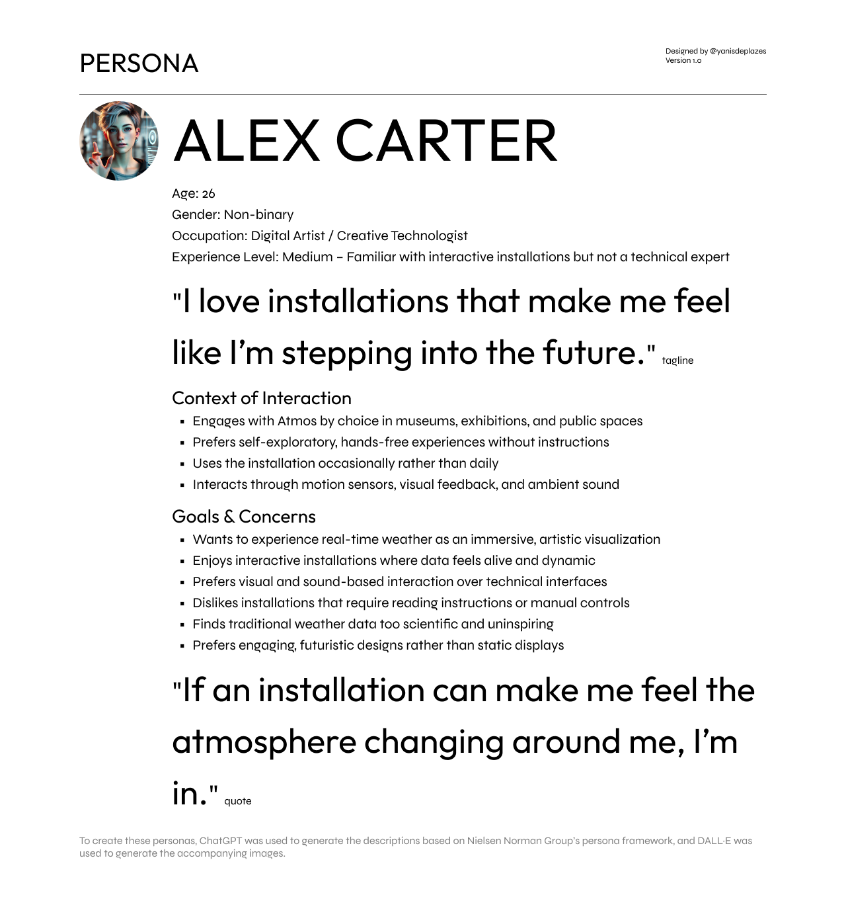
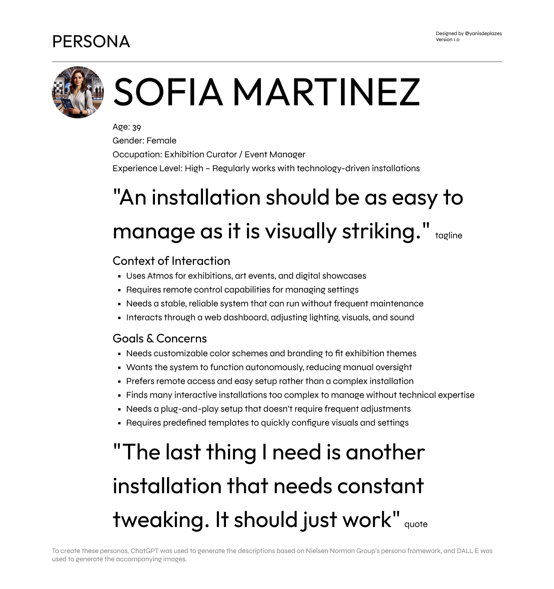
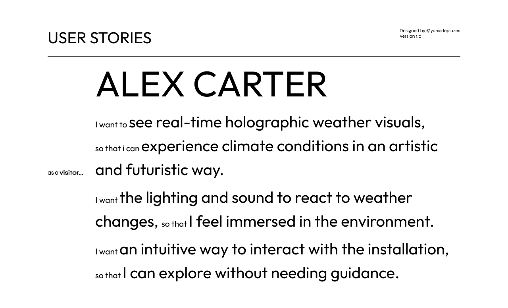
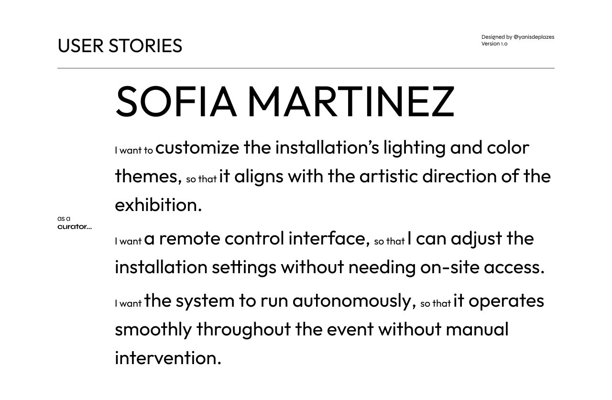
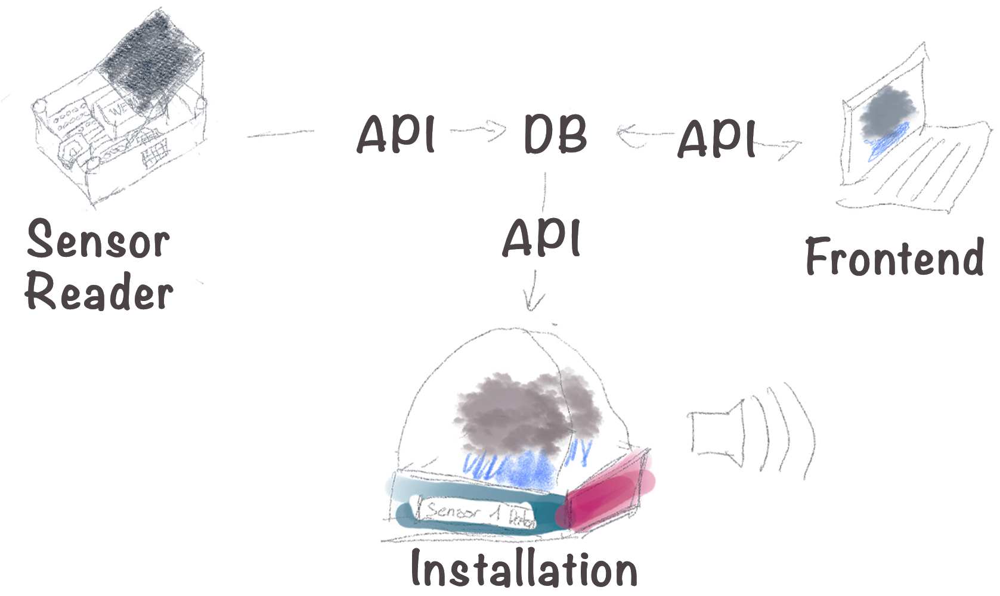
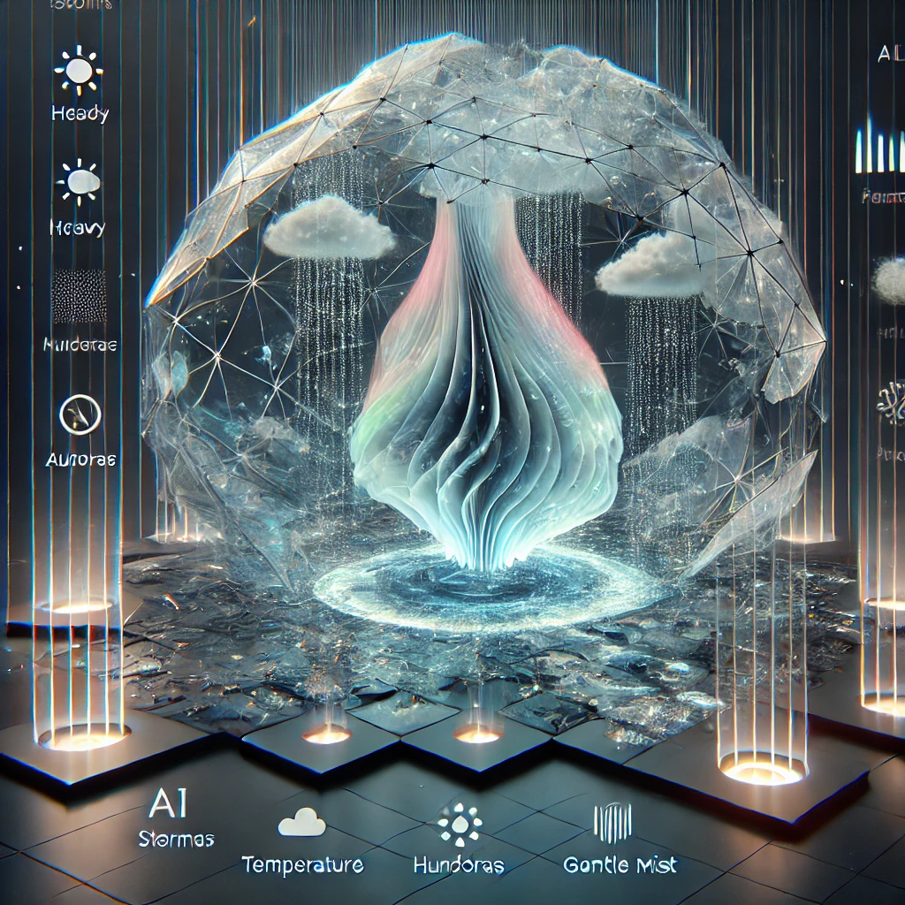
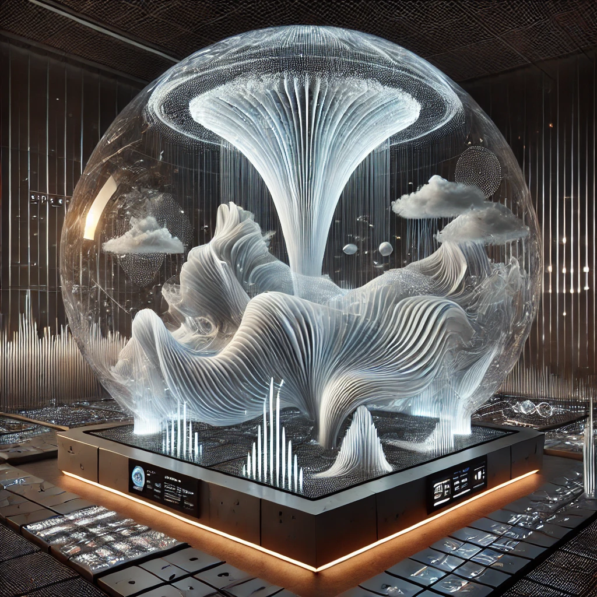
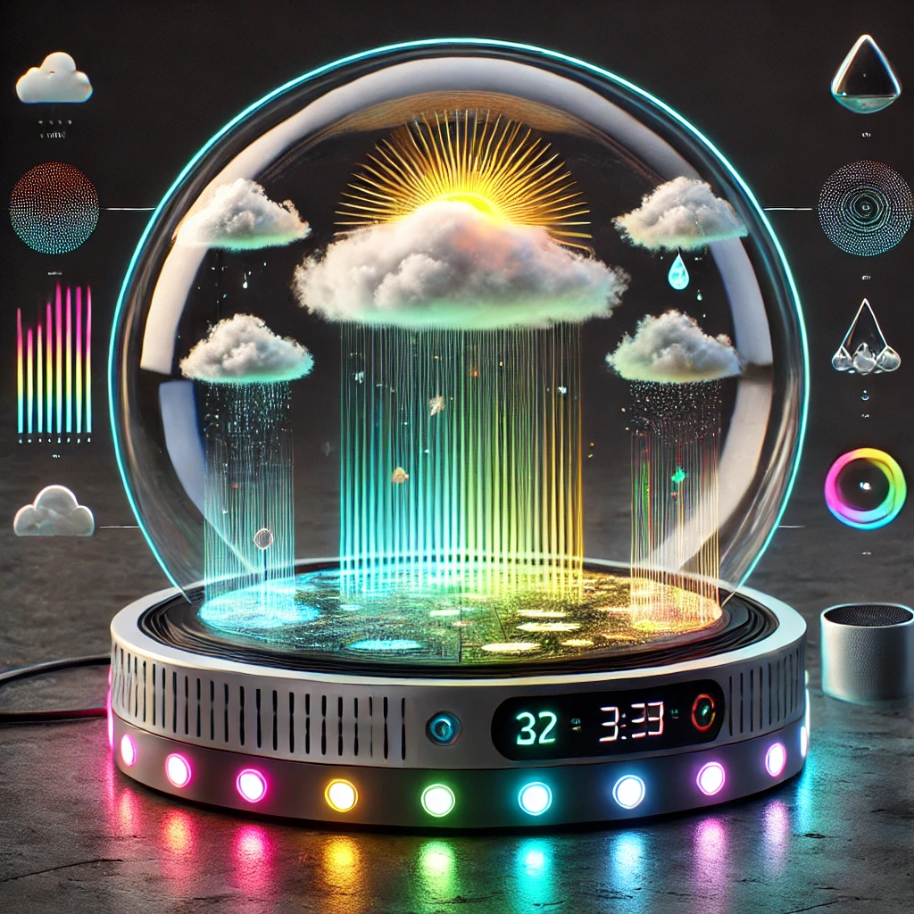
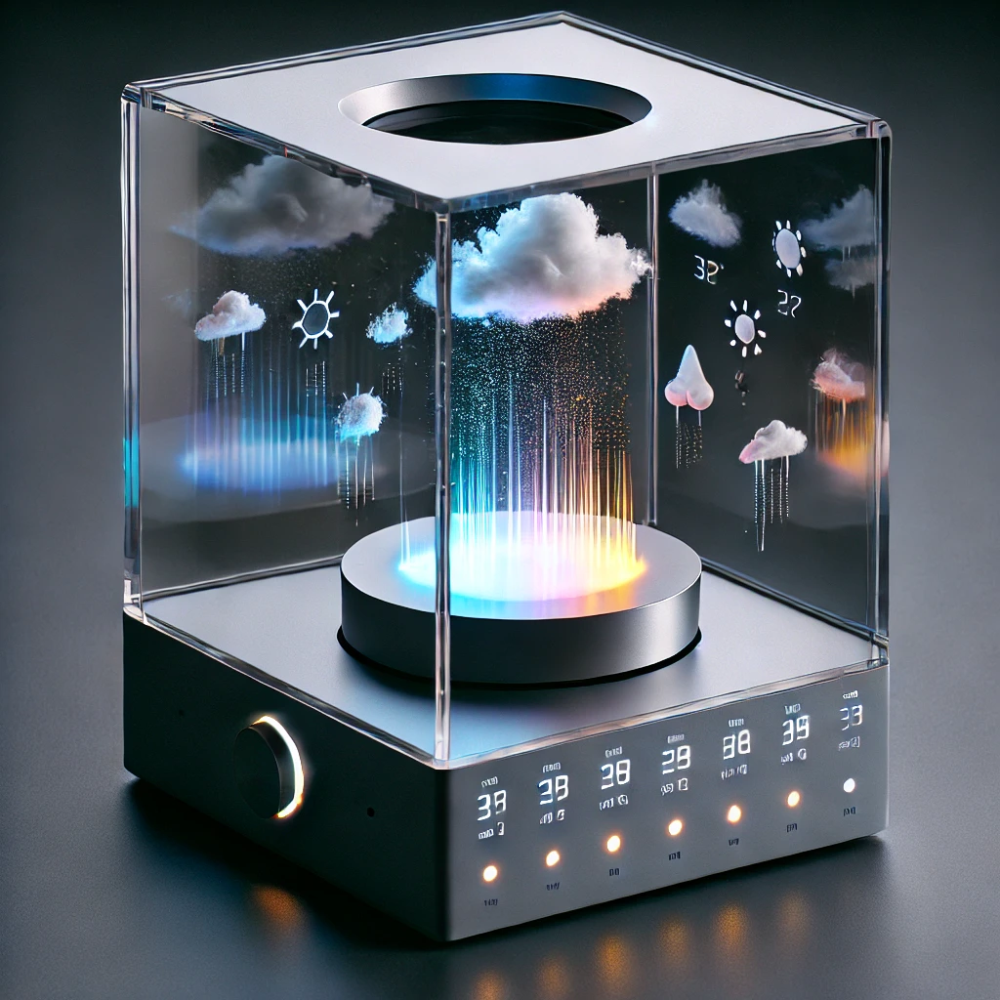
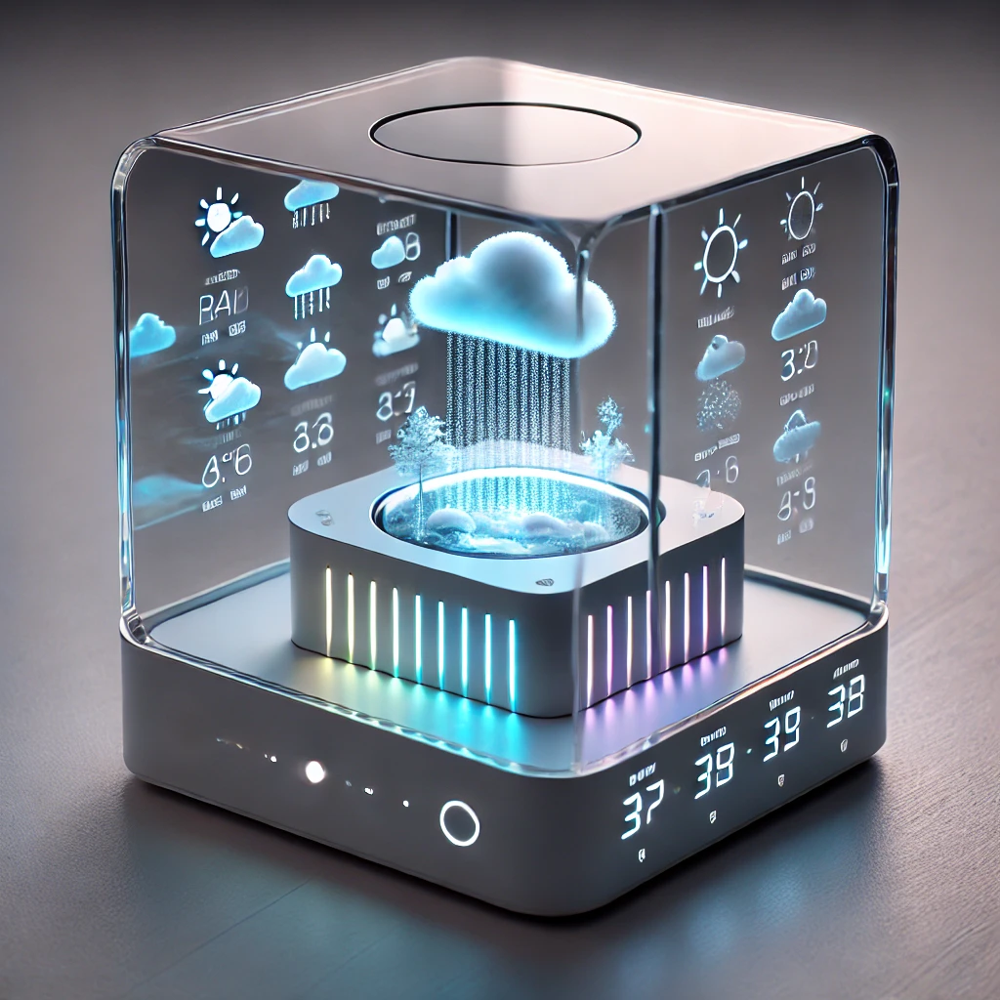

# Concept

## Vision

Atmos transforms real-time weather data into a holographic, audio-visual installation, creating a multi-sensory experience that blends science, technology, and art.

## Mission

- To reimagine weather by integrating light, and sound.
- To bridge data and art, making it engaging and intuitive.
- To create an immersive space where people can see, and hear the weather.

## Values

- Futuristic – Pushing boundaries with real-time visuals.
- Immersion – Experiencing through light, sound, and holography.
- Connectivity – Linking differet physical devices into one network.

## Users & User Needs

### Personas

To define the **Target users**, **Proto Personas** were used. These are based on **assumptions rather than on user research**. The selected Personas have a **narrow scope** and focus on the **specific product** instead of representing users across multiple products.

The following **framework** was used to describe each persona:

- **Name, age, gender, and a photo**
- **Tagline describing what they do**
- **Experience level**
- **Context of interaction**
- **Goals and concerns**
- **A direct quote**

> This is based on the <a href="https://www.nngroup.com/articles/personas-study-guide/" target="_blank">Nielsen Norman Group - Personas: Study Guide</a>.

### User Stories

To define the **User Needs**, **user stories** were used. Each user story follows the **as a [persona], I [want to], [so that]**.

> This is based on the <a href="https://www.atlassian.com/agile/project-management/user-stories" target="_blank">Atlassian - User story template and examples</a>.

## Main Goal

The main goal of **Atmos** is to allow users to **experience real-time weather data** in a way that is **engaging, immersive, and artistic** without the use of numbers as a value. It should create an environment where users can feel like they are truly experiencing the **weather** through **visuals** and **sounds**.

This goal should be achieved within the **10 weeks** of the IOT Program.

## Product Requirements

The product requirements ensure that **Atmos** meets the user expectations. Each of these product requirement features should be fully functional by **week 10**.

### Real-Time Weather Visualization

Visuals, lighting, and sound must update within 5 seconds of weather changes.

### Intuitive User Experience

Experience must feel natural, intuitive, and technologically innovative.

### Event Customization & Remote Control

Remote control via a web interface, with settings stored via API/database.

### Scalability & Replicability

The system must be modular, scalable, and well-documented for replication.

## Sketches and AI Generated Concepts

### AI Generated Concept with Chat GPT

## Version History

This section lists the project's Concept file, with each version reflecting incremental updates and refinements.

<b><a href="https://www.figma.com/design/W5R07DiWn7GgxeQxAFEyBe/Project-Overview?node-id=0-1&t=cJL0Ypo6CEVVz8kR-1" target="_blank">Project Concept</a></b>

- [005 - add Personas and User Stories](../assets/concept/005.fig)
- [004 - add Values](../assets/concept/004.fig)
- [003 - add Mission](../assets/concept/003.fig)
- [002 - add Vision](../assets/concept/002.fig)
- [001 - add Project Name & Tagline](../assets/concept/001.fig)
