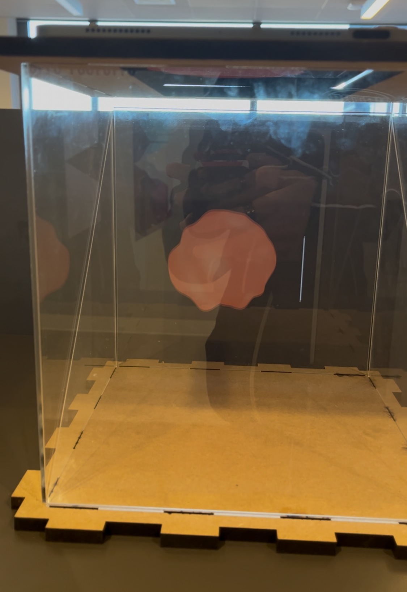

# Conclude & Reflect

## Video Demo

<video src="https://atmos.yanis.io/assets/ux/demo.mp4" controls width="600">
  Your browser does not support the video tag.
</video>

## Requirements

### Main Goal

**Description:** The main goal of **Atmos** is to allow users to **experience real-time weather data** in a way that is **engaging, immersive, and artistic** without the use of numbers as a value. It should create an environment where users can feel like they are truly experiencing the **weather** through **visuals** and **sounds**.

The main goal is **fully met** — the installation offers an experience that reflects live weather changes and is **engaging, immersive and artistic**, as the user testing during this project showed.

### Real-Time Weather Visualization

**Description:** Visuals, lighting, and sound must update within 5 seconds of weather changes.

The system allows a maximum delay of **4.5 seconds**. Which therefore **meets the requirement**.

### Intuitive User Experience

**Description:** Interaction must feel natural, intuitive, and technologically innovative.

The User tests showed a **high satisfaction** and **strong interest** in the **technology** used. (5 out of 5 people asked) Which therefore **meets the requirement**.

**Recommendation:**

- Add **animation and sound** on startup.

### Event Customization & Remote Control

**Requirement:** Remote control via a web interface, with settings stored via API/database.

The Settings features were set in the database and customizable via the Website. Which therefore **meets the requirement**.

**Recommendation:**

- Add a **live preview** showing how changes affect the visual blob and background in real time.

### Scalability & Replicability

**Requirement:** The system must be modular, scalable, and well-documented for replication.

The current architecture supports scalability. Each device is uniquely identified via MAC address and automatically registered. The sensor setup is also extendable. Which therefore **meets the requirement**.

With the current documentation it should be really easy to replicate it. (Must be tested)

**Recommendation:**

- Add a **modular sensors system**, which allow new sensor types to be added easily and influencing how the installation and website reacts to different data inputs.

## Failures

### KERF not optimal

**Goal:** Precise cuts for the cube via makercase.
**Issue:** The kerf was a bit too tight which made it hard to assemble the cubes.
**Fix:** Sanded them down.  
**Next time:** Test kerf on some small scale beforehand.

### Needed support for sensor

**Goal:** Fit all sensors on top of the cube.  
**Issue:** The water and KY sensors weren't measured beforehand and overlapped.  
**Fix:** Added little MDF support plates to lift them.  
**Next time:** Actually measure the sensor size beforehand, not just the connector end.

### Plexiglas too expensive

**Goal:** Use clear material for the Pepper’s Ghost effect.  
**Issue:** Plexiglas was way too expensive.  
**Fix:** No Fix, had to get the plexiglas.
**Next time:** Look into cheaper stuff during material research.

### Hard to see in bright spaces

**Goal:** Make sure the visuals work in the presentaiton room.
**Issue:** In bright rooms, the hologram wasn't really visible.  
**Fix:** Added black foam around it for presentations in bright spaces.  
**Next time:** Use a brighter screen and build in some shading.
