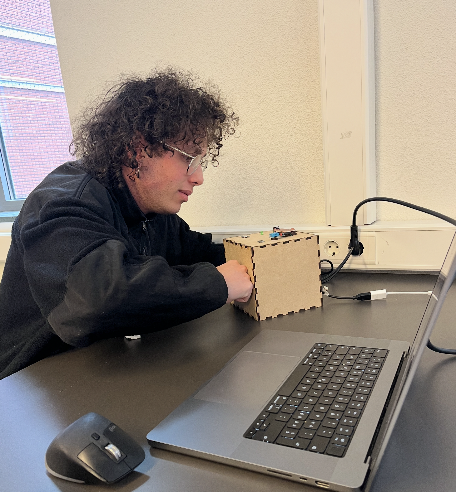

# Create & Test

## DIGITAL MANUFACTURING

### Device(s) and Material

The device and materials were selected based on the available tools at the MakersLab at HVA.
Tried to be as cost-effective as possible while still using good materials to match the needs of the product.

#### Device

**Laser Cutter**  
Used for cutting all components (MDF and acrylic). Which is quiet precise and easy to use and also doesn't take long time if something might go wrong.

##### Reference: MakersLab Resources

Refer to the following sites for the laser cutter at HVA:

- [MakersLab Laser Cutter Overview](https://www.hva.nl/samenwerken/labs/makerslab/lasersnijder)
- [Laser Cutter Cheatsheet (PDF)](https://cms-prd.cms.hva.nl/site/binaries/content/assets/shared/site-secties/labs/makerslab/cheatsheet_laser_.pdf)

#### Material

**MDF (Medium-Density Fiberboard)**

- **9mm MDF**

  - Quantity: 1 sheet
  - Size: 1220 mm × 610 mm × 9 mm
  - Use: Main installation cube
  - Reasoning: Strong and affordable.

- **4mm MDF**
  - Quantity: 1 sheet
  - Size: 500 mm × 350 mm × 4 mm
  - Use: Reader cube and smaller support elements
  - Reasoning: Lightweight and affordable.

**Acrylic (Plexiglas)**

- **3mm Acrylic**
  - Quantity: 1 sheet
  - Size: 600 mm × 1200 mm × 3 mm
  - Use: Transparent parts for Pepper's Ghost cube
  - Reasoning: Provides best optical clarity.

#### Justification

These materials are accessible and effective for the structural and aesthetic needs.

### Manufacturing Settings

The following predefined settings were used from the laser cutter at the HVA MakersLab.

**Acrylic 3mm Cutout**

- Speed: 15 mm/s
- Power: 70%
- Min Power: 70%
- Passes: 1

**MDF 4mm Cutout**

- Speed: 30 mm/s
- Power: 65%
- Min Power: 60%
- Passes: 1

**MDF 9mm Cutout**

- Speed: 12 mm/s
- Power: 80%
- Min Power: 75%
- Passes: 1

### Optimisations

- Paths were merged to one file to reduce laser time.
- Nesting of parts for minimal waste.
- Labels and unnecessary paths removed from SVG files.

### Process

#### Laser Cut Material

##### 1. Laser Cut 9mm MDF for Installation

- Place the **9mm MDF plate** on the laser bed
- Open the laser cutting software and **import the SVG file**: ([2024-04-04_installation_mdf_9mm.svg](../assets/design/2024-04-04_installation_mdf_9mm.svg))
- Asign 9mm MDF Settings to the cutout
- Send the file to the machine and load it
- **Calibrate the laser focus** manually
- Set the **origin point** and use the **framing function** to verify alignment
- Recalibrate if needed, then start the cutting process

##### 2. Laser Cut 4mm MDF for Sensor Reader

- Place the **4mm MDF plate** on the laser bed
- Open the laser cutting software and **import the SVG file**: ([2024-04-04_installation_mdf_9mm.svg](../assets/design/2024-04-reader_mdf_4mm.svg))
- Asign 9mm MDF Settings to the cutout
- Send the file to the machine and load it
- **Calibrate the laser focus** manually
- Set the **origin point** and use the **framing function** to verify alignment
- Recalibrate if needed, then start the cutting process

##### 3. Laser Cut 3mm Acrylic for Installation

- Place the **3mm Acrylic plate** on the laser bed
- Open the laser cutting software and **import the SVG file**: ([2024-04-04_installation_mdf_9mm.svg](../assets/design/2024-04-04_installation_acryl_3mm.svg))
- Asign 9mm MDF Settings to the cutout
- Send the file to the machine and load it
- **Calibrate the laser focus** manually
- Set the **origin point** and use the **framing function** to verify alignment
- Recalibrate if needed, then start the cutting process

#### 4. Assemble the Boxes

- Assemble the bottom, and side panels of each cube
- **important:** Leave one side (left or right or top) open for internal wiring

#### 5. Assemble the Parts

- Place the **Wemos**, **ESP32** and their breadboard into the boxes
- Check all wire connections
- Insert the **speaker** into its slot
- Insert the **LEDs** into the Box

#### 6. Glue Parts

- Use **hot glue** to fix sensors on the top of the sensor cube
- Use **hot glue** to fix the window from the inside to avoid gaps
- Use **hot glue** to fix **LEDs** for better alignment.
- Add **support parts** if needed (refer to example build)

#### 7. Close the Boxes

- Add the USB-C Connections to the boards
- Close the Cubes

#### 8. Assemble the top part when needed

- When the installation is needed, **slide the acrylic glass into the side slots**
- Add the Vertical plate into the top box, make sure it faces the correct direction (Tilted towards the back)
- Carefully **place the top MDF plate** onto the cube while ensuring the acrylic stays in place

#### 9. Done :)

### Files

These are the relevant design files as illustrator files for references:

- [2024-04-04_installation_acryl_3mm.ai](../assets/design/2024-04-04_installation_acryl_3mm.ai)
- [2024-04-04_sensor-reader_mdf_4mm.ai](../assets/design/2024-04-04_sensor-reader_mdf_4mm.ai)
- [2024-04-04_installation_mdf_9mm.ai](../assets/design/2024-04-04_installation_mdf_9mm.ai)

## (USER)TEST

### Requirements

The following requirements were choosen based on impact on design and user needs:

#### Real-Time Weather Visualization

Visuals, lighting, and sound must update within 5 seconds of weather changes.

#### Intuitive User Experience

Experience must feel natural, intuitive, and technologically innovative.

### How was it tested?

An observational testing method was used with a total of 5 users.  
The participants were invited to freely explore the system without a predefined task.

Their behavior and reactions were observed, notes were taken during and after the testing, with question how they feel and what struggles they had during the interaction.

> No major changes were required for the physical components.
> Focus was placed on improving the **software**.

### Observations

- **5 out of 5** were impressed by the visuals and described them as engaging.
- **5 out of 5** were curious about how the system works.
- **5 out of 5** mentioned that the visuals were hard to see in a bright environment.
- **4 out of 5** noticed that the update speed from the sensor to the installation felt slow or unstable.
- **4 out of 5** found the IR sensor unnecessary.
- **2 out of 5** asked what variables control the installation.

### Conclusion (prioritized)

1. **Visuals are effective** – all users found the system visually engaging.
2. **Visibility is limited in bright environments** – the experience isn't really good in bright lights.
3. **Blob behavior sparks curiosity** – users wanted to understand how it works.
4. **IR sensor caused confusion** – users struggled to understand and rely on it.
5. **Update speed could be improved** – some delay was noticed during testing.
6. **Lack of context** – users asked what controls the visuals, indicating a need for explanation.

### Optimisation

To improve the experience based on user feedback, the following optimizations were implemented:

- Added a **black foam frame** to block external light and improve visual contrast
- Removed the **IR sensor**, making the system **fully autonomous**
- Created a **printed data sheet** to explain how sensor data maps to system behavior
- Improved **update speed** and reliability using **atomic POST requests**
