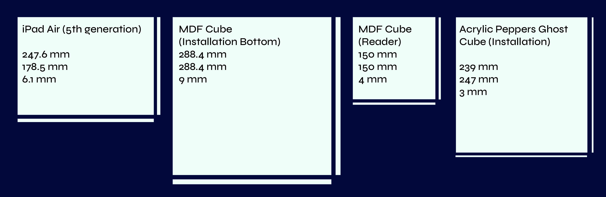
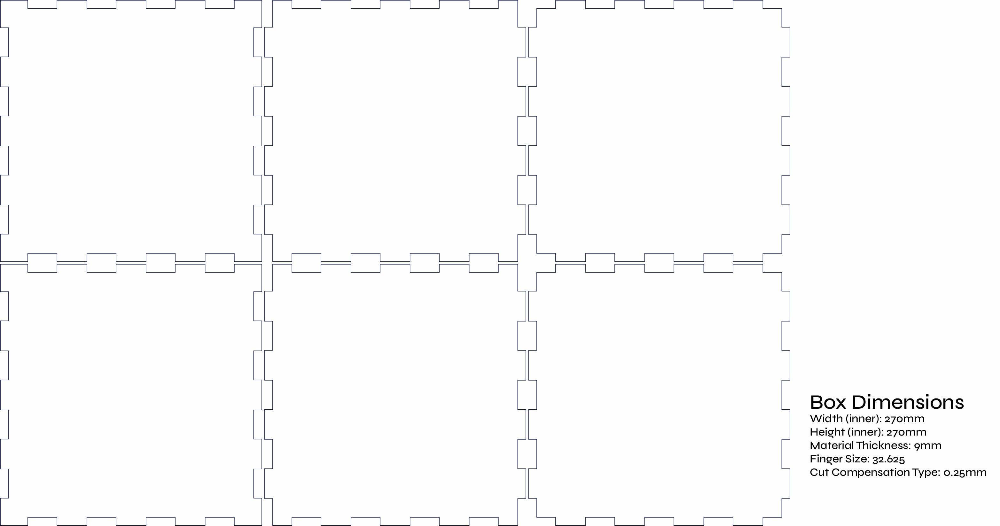
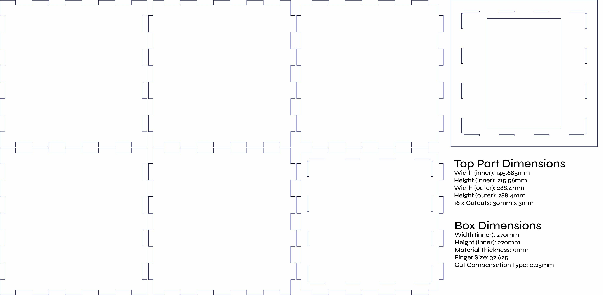
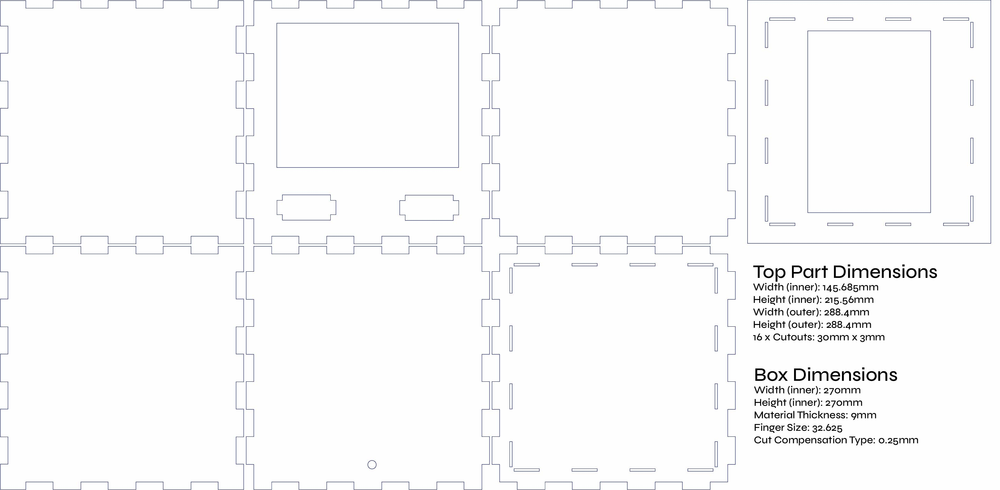
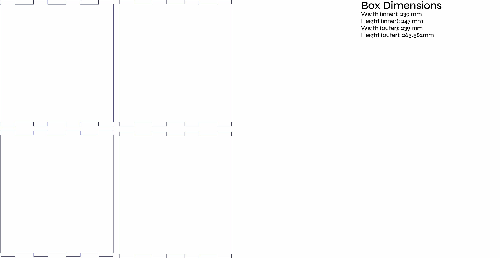
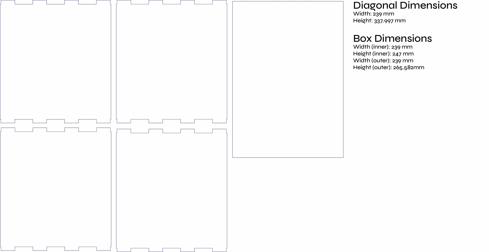
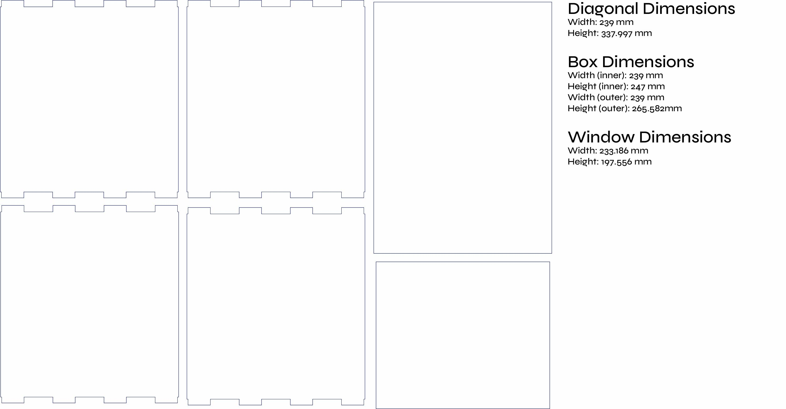
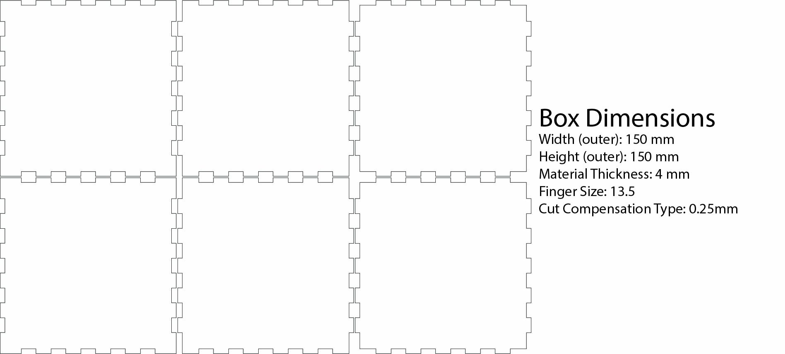
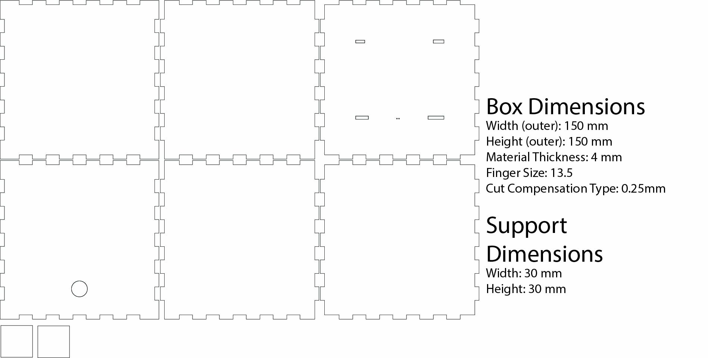

# Design

## Brand Design

- **FIGMA**: Design files (Brand Design)

### Typography

#### Font Styles

Three font styles have been defined for the project, all sourced from **Google Fonts**:

- **Primary Font:** Outfit
- **Secondary Font:** Syne
- **Code Font**: Fira Code

Each font serves a specific purpose, ensuring a cohesive and structured typography system throughout the design.

#### Font Scale

For consistency in font scaling, the **perfect fourth scale (1.333)** has been applied. Font sizes have been slightly adjusted to avoid decimal pixel values, ensuring proper rendering. It's important to note that the defined heading scale serves as a general guideline rather than strict usage rules. For instance, an h1 element can adopt the heading 4 style if required by the design.

### Colors

The color palette is designed to reinforce the **futuristic, immersive, and data-driven aesthetics** of Atmos. The combination of **triadic colors and structured neutrals** ensures a balance between **holographic visuals, interactive elements, and readability** while maintaining high contrast for clarity.

#### Primary Color

**Aqua (#00F7FF)**

A highly vibrant cyan that serves as the **core identity color**, defining the **holographic glow**, **interactive UI elements**, and **real-time weather effects** within the installation.

#### Secondary Colors

The secondary colors were determined using a **triadic scheme**, ensuring a dynamic and visually striking balance. These colors enhance the **energy, contrast, and motion-based visuals** within the project.

**School Bus Yellow (#FFD900)**
**Hollywood Cerise (#FF00AB)**

#### Neutral & Structural Colors

Neutral colors provide **structure and contrast**, ensuring that **UI elements remain legible** while supporting a futuristic yet functional aesthetic.

**Penn Blue (#030637)**  
A deep, near-black blue that acts as the **primary dark background and text**, enhancing visibility for bright, neon-lit elements.

**Azure (#E8E8E8)**  
A soft, cool gray used for **bright background surfaces and text**, ensuring high readability against darker UI components.

#### Mesh Gradient

The **Mesh Gradient** blends the **neutral colors (Penn Blue & Azure) with the primary Aqua** to create a **smooth, futuristic background effect**. This gradient adds **depth, fluidity, and a holographic feel**, making it ideal for **backgrounds, UI elements, and ambient lighting transitions**.

#### Heat Scale Gradient

This gradient represents temperature changes, transitioning smoothly from **cold to hot**.

- **Deep Blue to Cyan (#070E88 → #00F7FF)** – Cold temperatures.
- **Cyan to Yellow (#00F7FF → #FFD900)** – Neutral and warming phases.
- **Yellow to Red (#FFD900 → #FF645C)** – High heat intensity.
- **Red to Magenta (#FF645C → #FF00AB)** – Extreme heat and storm energy.

This gradient is used for **temperature-based lighting, UI elements, and visual transitions**, ensuring **clear and intuitive weather representation**.

## Physical Design

### digital manufacturing technique(s) and material(s)

The manufacturing technique was selected based on the available resources at the MakersLab at HVA, ensuring feasibility. Material choices were made considering cost-effectiveness and precision to meet the project's requirements.

#### Technique

The design was created in **Adobe Illustrator** using vector-based files, which allowed precise layout for laser cutting.

#### Material

**MDF (Medium-Density Fiberboard)**

- **9mm MDF**

  - Quantity: 1 sheet
  - Size: 1220 mm × 610 mm × 9 mm
  - Use: Main installation cube
  - Reasoning: Strong, affordable, and laser-compatible

- **4mm MDF**
  - Quantity: 1 sheet
  - Size: 500 mm × 350 mm × 4 mm
  - Use: Reader cube and smaller support elements
  - Reasoning: Lightweight and sufficient for smaller structural parts

**Acrylic (Plexiglas)**

- **3mm Acrylic**
  - Quantity: 1 sheet
  - Size: 600 mm × 1200 mm × 3 mm
  - Use: Transparent parts for Pepper's Ghost cube
  - Reasoning: Provides optical clarity and rigidity

#### Justification

These materials are both accessible and effective for structural and aesthetic needs.

### DIGITAL DESIGN

#### Software

- **Illustrator**: Used to create precise vector-based design files for laser cutting. This software enables accurate cut line alignment and allows for easy modifications throughout the design process.

#### Design Proces

##### 1. Added Sizes

Determined the base dimensions for the different parts such as the iPad, both device cubes, and the Pepper’s Ghost cube.

- Add rectangles and the dimensions in Illustrator
- Visualize all base sizes to get a clear spatial overview

##### 2. Added MDF Installation Cube Cutouts

Created the bottom part of the installation cube using [MakerCase](https://en.makercase.com).

- Create box with MakerCase
- Import the generated SVG into Illustrator
- Remove labels if not needed

##### 3. Added MDF Installation Top Cutouts

Designed top panel with:

- Add a rectangle using the defined dimensions
- Cut a display window based on iPad size
- Add small slots for the Plexiglas joints (same height as Plexiglas thickness)

##### 4. Added MDF Installation Part Cutouts

Extended the bottom cube with:

- Speaker cutout (shape depends on speaker, use Shape Builder if complex)
- Small circle cutout for USB power access on the back
- Added Plexiglas window cutout

##### 5. Added Plexiglas Cube Cutouts

Outlined the Plexiglas cube and added joints using the Shape Builder tool.

- Add rectangles for each panel
- Align slot cuts from the MDF top
- Use Shape Builder to match joints

##### 6. Added Plexiglas Diagonal Cutout

Calculated diagonal using Pythagoras. Added the angled reflective panel for Pepper’s Ghost.

- Add rectangle based on calculated diagonal height
- Width = inner width of the cube

##### 7. Added Plexiglas Window Cutout

Created a viewing window in the Plexiglas for the bottom.

- Cut a slightly larger window than defined in Step 4
- Ensure it fits tightly without falling through

##### 8. Added MDF Reader Cube Cutouts

Created the reader cube using MakerCase.

- Generate box with MakerCase
- Import into Illustrator
- Clean up labels

##### 9. Added MDF Reader Part Cutouts

Integrated cutouts for sensor access and power.

- Measure sensors + LEDs
- Add rectangle + circle cutouts on the top
- Position for full accessibility

##### 10. Added MDF Reader Support Cutouts

Created small support structures for stability.

- Add two 30mm × 30mm cutouts
- These act as internal support blocks

## Version History

This section lists the project's Design files, with each version reflecting incremental updates and refinements.

[Digital Design (Illustrator Files)](../assets/design/final.ai)

- [010 - Added MDF Reader Support Cutouts](../assets/design/010.ai)
- [009 - Added MDF Reader Part Cutouts](../assets/design/009.ai)
- [008 - Added MDF Reader Cube Cutouts](../assets/design/008.ai)
- [007 - Added Plexiglas Window Cutout](../assets/design/007.ai)
- [006 - Added Plexiglas Diagonal Cutout](../assets/design/006.ai)
- [005 - Added Plexiglas Cube Cutouts](../assets/design/005.ai)
- [004 - Added MDF Installation Part Cutouts](../assets/design/004.ai)
- [003 - Added MDF Installation Top Cutouts](../assets/design/003.ai)
- [002 - Added MDF Installation Cube Cutouts](../assets/design/002.ai)
- [001 - Added Sizes](../assets/design/001.ai)

<b><a href="https://www.figma.com/design/6EHWcd7kw9klRG6YOhArdk/Design?node-id=4-3&t=gGNsd1avlazcPU8F-1" target="_blank">Brand Design (Figma)</a></b>

- [002 - add Colors & Gradients](../assets/design/002.fig)
- [001 - add Typography](../assets/design/001.fig)
