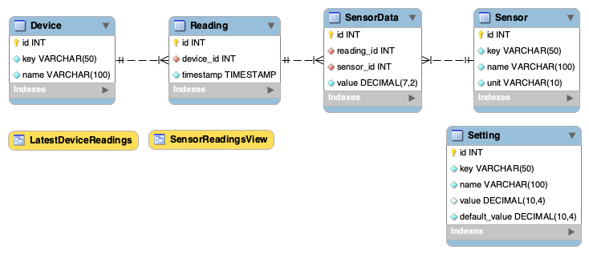
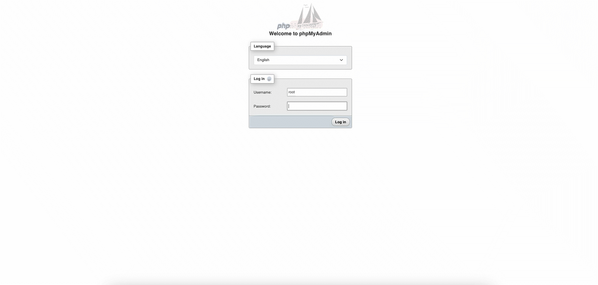

# Database

## Introduction

The database is designed to store the sensor data from the embedded devices efficiently. With focus on **scalability and integrity**, making it modular.

##  Technology

- **MariaDB** as the relational database.
- **phpMyAdmin** for database management.
- **Draw.io** for ERD diagram concept.
- **MySQL Workbench** for designing the database schema.

All communication with the database is handled through the **[API](./api_reference.md)**.

### Considerations

The technologies were chosen based on the recommendations of the IOT's teachers. While NoSQL was considered, SQL proved to be more efficient for the project's structured approach. Additionally, these technologies are widely used in the industry, ensuring compatibility and best practices.

## Database Design

### Design Choices & Candidate Keys

The following tables describe **each entity in the database**, the **chosen candidate keys**, and the **reasoning behind the design decisions**.

#### Device Table

| Column | Data Type            | Constraints     | Candidate Key | Use Case & Design Choice                             |
| ------ | -------------------- | --------------- | ------------- | ---------------------------------------------------- |
| `id`   | `INT AUTO_INCREMENT` | PRIMARY KEY     | Yes           | Ensures each device has a unique identifier.         |
| `key`  | `VARCHAR(50)`        | UNIQUE NOT NULL | Yes           | Allows human-friendly lookup (e.g., `sensor_hub_1`). |
| `name` | `VARCHAR(100)`       | UNIQUE NOT NULL | No            | Descriptive name for UI, but not used as a key.      |

#### Reading Table

| Column      | Data Type            | Constraints                 | Candidate Key | Use Case & Design Choice                       |
| ----------- | -------------------- | --------------------------- | ------------- | ---------------------------------------------- |
| `id`        | `INT AUTO_INCREMENT` | PRIMARY KEY                 | Yes           | Ensures each reading has a unique identifier.  |
| `device_id` | `INT`                | FOREIGN KEY                 | No            | Links readings to a specific device.           |
| `timestamp` | `TIMESTAMP`          | DEFAULT `CURRENT_TIMESTAMP` | No            | Automatically records when a reading is taken. |

#### Sensor Table

| Column | Data Type            | Constraints     | Candidate Key | Use Case & Design Choice                              |
| ------ | -------------------- | --------------- | ------------- | ----------------------------------------------------- |
| `id`   | `INT AUTO_INCREMENT` | PRIMARY KEY     | Yes           | Ensures uniqueness for each sensor type.              |
| `key`  | `VARCHAR(50)`        | UNIQUE NOT NULL | Yes           | Used for lookups, prevents duplicate sensor types.    |
| `name` | `VARCHAR(100)`       | NOT NULL        | No            | Descriptive name, but not unique enough for indexing. |
| `unit` | `VARCHAR(10)`        | NOT NULL        | No            | Stores unit of measurement (e.g., `°C`, `hPa`).       |

#### SensorData Table

| Column       | Data Type            | Constraints | Candidate Key | Use Case & Design Choice                        |
| ------------ | -------------------- | ----------- | ------------- | ----------------------------------------------- |
| `id`         | `INT AUTO_INCREMENT` | PRIMARY KEY | Yes           | Ensures each sensor reading is uniquely stored. |
| `reading_id` | `INT`                | FOREIGN KEY | No            | Links to the `Reading` table.                   |
| `sensor_id`  | `INT`                | FOREIGN KEY | No            | Links to the `Sensor` table.                    |
| `value`      | `DECIMAL(7,2)`       | NOT NULL    | No            | Stores the sensor measurement with precision.   |

#### Setting Table

| Column          | Data Type            | Constraints     | Candidate Key | Use Case & Design Choice                       |
| --------------- | -------------------- | --------------- | ------------- | ---------------------------------------------- |
| `id`            | `INT AUTO_INCREMENT` | PRIMARY KEY     | Yes           | Uniquely identifies each setting.              |
| `key`           | `VARCHAR(50)`        | UNIQUE NOT NULL | Yes           | Used for lookup in the system.                 |
| `name`          | `VARCHAR(100)`       | NOT NULL        | No            | Descriptive setting name.                      |
| `value`         | `DECIMAL(10,4)`      | NULL            | No            | Stores user-defined value (overrides default). |
| `default_value` | `DECIMAL(10,4)`      | NOT NULL        | No            | Stores the system's fallback setting.          |

### ERD Schema

The diagram below represents the **Entity-Relationship Diagram (ERD)** for the database, illustrating how the tables relate to each other.



---

### Database Schema

The following SQL script defines the **Schema** for the database.

```sql
-- Create the Database
CREATE DATABASE IF NOT EXISTS `atmos`;
USE `atmos`;

-- Create Device Table
CREATE TABLE IF NOT EXISTS `Device` (
    `id` INT AUTO_INCREMENT PRIMARY KEY,
    `key` VARCHAR(50) UNIQUE NOT NULL,
    `name` VARCHAR(100) UNIQUE NOT NULL
);

-- Create Reading Table
CREATE TABLE IF NOT EXISTS `Reading` (
    `id` INT AUTO_INCREMENT PRIMARY KEY,
    `device_id` INT NOT NULL,
    `timestamp` TIMESTAMP DEFAULT CURRENT_TIMESTAMP,
    FOREIGN KEY (`device_id`) REFERENCES `Device`(`id`) ON DELETE CASCADE
);

-- Create Sensor Table
CREATE TABLE IF NOT EXISTS `Sensor` (
    `id` INT AUTO_INCREMENT PRIMARY KEY,
    `key` VARCHAR(50) UNIQUE NOT NULL,
    `name` VARCHAR(100) NOT NULL,
    `unit` VARCHAR(10) NOT NULL
);

-- Create Sensor Data Table
CREATE TABLE IF NOT EXISTS `SensorData` (
    `id` INT AUTO_INCREMENT PRIMARY KEY,
    `reading_id` INT NOT NULL,
    `sensor_id` INT NOT NULL,
    `value` DECIMAL(7,2) NOT NULL,
    FOREIGN KEY (`reading_id`) REFERENCES `Reading`(`id`) ON DELETE CASCADE,
    FOREIGN KEY (`sensor_id`) REFERENCES `Sensor`(`id`) ON DELETE CASCADE
);

-- Create Setting Table
CREATE TABLE IF NOT EXISTS `Setting` (
    `id` INT AUTO_INCREMENT PRIMARY KEY,
    `key` VARCHAR(50) UNIQUE NOT NULL,
    `name` VARCHAR(100) NOT NULL,
    `value` DECIMAL(10,4) NULL,
    `default_value` DECIMAL(10,4) NOT NULL
);

-- Indexes for performance
CREATE INDEX `idx_sensor_key` ON `Sensor` (`key`);
CREATE INDEX `idx_setting_key` ON `Setting` (`key`);
CREATE INDEX `idx_device_timestamp` ON `Reading` (`device_id`, `timestamp`);
CREATE INDEX `idx_sensor_data_reading` ON `SensorData` (`reading_id`);
CREATE INDEX `idx_sensor_data_sensor` ON `SensorData` (`sensor_id`);
```

## Data Inserts

This section provides predefined data inserts for **sensors and system settings**, ensuring the project is ready.

### Add Arduino Sensors to the Sensor Table

```sql
INSERT INTO `Sensor` (`key`, `name`, `unit`) VALUES
    ('dht11_temperature', 'DHT11 Temperature Sensor', '°C'),
    ('dht11_humidity', 'DHT11 Humidity Sensor', '%'),
    ('bh1750_lux', 'BH1750 Light Sensor', 'lux'),
    ('analog_water', 'Analog Water Sensor', 'level'),
    ('bmp180_temperature', 'BMP180 Temperature Sensor', '°C'),
    ('bmp180_pressure', 'BMP180 Pressure Sensor', 'hPa');
```

### Add Arduino Sensors to the Sensor Table

```sql
INSERT INTO `Setting` (`key`, `name`, `value`, `default_value`) VALUES
    ('pressure_min', 'Minimum Atmospheric Pressure', NULL, 900),
    ('pressure_max', 'Maximum Atmospheric Pressure', NULL, 1080),
    ('wind_speed_min', 'Minimum Wind Speed', NULL, 0),
    ('wind_speed_max', 'Maximum Wind Speed', NULL, 100),
    ('temperature_min', 'Minimum Temperature', NULL, -10),
    ('temperature_max', 'Maximum Temperature', NULL, 50),
    ('lux_min', 'Minimum Light Intensity (Lux)', NULL, 0),
    ('lux_max', 'Maximum Light Intensity (Lux)', NULL, 1000),

    ('blob_intensity_min', 'Minimum Blob Intensity', NULL, 0.05),
    ('blob_intensity_max', 'Maximum Blob Intensity', NULL, 1),
    ('blob_speed_min', 'Minimum Blob Movement Speed', NULL, 0.01),
    ('blob_speed_max', 'Maximum Blob Movement Speed', NULL, 0.5),

    ('background_noise_scale_min', 'Minimum Background Noise Scale', NULL, 5),
    ('background_noise_scale_max', 'Maximum Background Noise Scale', NULL, 10),
    ('background_height_min', 'Minimum Background Height', NULL, 0.5),
    ('background_height_max', 'Maximum Background Height', NULL, 2.5),
    ('background_speed_min', 'Minimum Background Movement Speed', NULL, 1),
    ('background_speed_max', 'Maximum Background Movement Speed', NULL, 60),
    ('background_brightness_min', 'Minimum Background Brightness', NULL, 0.1),
    ('background_brightness_max', 'Maximum Background Brightness', NULL, 1),

    ('color_temperature_threshold', 'Temperature Threshold for Color Changes', NULL, 10),
    ('color_humidity_brightness_factor', 'Impact of Humidity on Color Brightness', NULL, 1);
```

## Views

Views allow for efficient querying and pre-processing of sensor data, providing structured results without complex SQL joins in API queries.

### Latest Sensor Readings Per Device

Fetches the most recent sensor readings per device, ensuring that each device only appears once with its latest values.

```sql
SELECT * FROM LatestDeviceReadings;
```

```sql
CREATE VIEW LatestDeviceReadings AS
SELECT
    d.id AS device_id,
    d.name AS device_name,
    s.name AS sensor_name,
    s.unit AS sensor_unit,
    sd.value,
    r.timestamp
FROM SensorData sd
JOIN Reading r ON sd.reading_id = r.id
JOIN Device d ON r.device_id = d.id
JOIN Sensor s ON sd.sensor_id = s.id
WHERE r.timestamp = (
    SELECT MAX(r2.timestamp) FROM Reading r2 WHERE r2.device_id = d.id
)
ORDER BY r.timestamp DESC;
```

## Step-by-Step Guide

This guide shows how to **create the database, add a user, and import the SQL script** inside the **Docker-powered phpMyAdmin environment**.

**`YOUR_DB_NAME`** is `atmos` by default, but you can use a different name—just make sure to update the SQL script to reference the correct database.

📌 The full SQL script is available on **[GitLab](https://github.com/YanisDeplazes/atmos/tree/main/docs/assets/web/db.sql?ref_type=heads)**.

### 1. Start phpMyAdmin



1. **Run Docker** (if not already running).
2. Open **[localhost/phpmyadmin](http://localhost/phpmyadmin)**.
3. **Log in** with root MySQL credentials. (Can be found in the `.env` in the root of the repository)

### 2. Create the Database


1. Go to the **Databases** tab.
2. Enter **`YOUR_DB_NAME`** as the database name.
3. Select **utf8mb4_general_ci** collation.
4. Click **Create**.

### 3. Create a New User


1. Navigate to **User accounts**.
2. Click **Add user account**.
3. Set:
   - **Username**: Set a username
   - **Host**: `localhost` or `%` depending on the network.
   - **Password**: Set a password
4. Click **Go** to create the user.
5. Under **Database**, select **Grant privileges on database** → Choose **`atmos`**.
6. Under **Data** grant the following privileges:
   - `SELECT`
   - `INSERT`
   - `UPDATE`
   - `DELETE`
7. Click **Go** to update the user.

### 4. Import the SQL Script


1. Go to **Import**.
2. Click **Choose File** → Select the **SQL script**.
3. Click **Go** to execute it.

### 5. Verify the Setup


1. Open the **atmos** database in phpMyAdmin.
2. Check if all tables exist.
3. Run `SELECT * FROM Setting;` to test the data.

### File

📌 The full SQL script is available on **[GitLab](https://github.com/YanisDeplazes/atmos/tree/main/docs/assets/web/db.sql?ref_type=heads)**.
