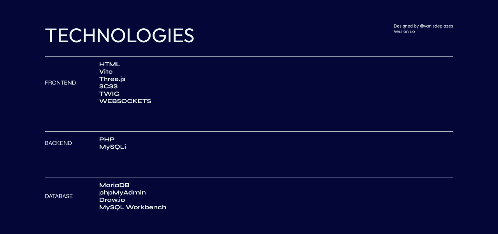

# Technical Documentation

## Technologies

### **Frontend**

- **HTML** – Structuring the web page.
- **Vite** – Fast development server and build tool for frontend assets.
- **Three.js** – Rendering 3D content interactively.
- **SCSS** – Styling with modular and reusable CSS components.
- **TWIG** – PHP Templating engine for modular and dynamic HTML.
- **Websockets** - Allowing Real-time communication with Embedded devices.

### **Backend**

- **PHP** – Server-side scripting for handling API requests.
- **MySQLi** – PHP extension for interacting with the database.

### **Database**

- **MariaDB** as the relational database.
- **phpMyAdmin** for database management.
- **Draw.io** for ERD diagram concept.
- **MySQL Workbench** for designing the database schema.

### Considerations

While **Express.js** was considered for the backend due to its popularity and ease of maintenance, the decision was made to follow the specifications from the project rubric. However, using Express.js could be a potential optimization for future improvements.

## Problems Encountered & Solutions

### Cross-Origin Requests (CORS)

**Problem:** Frontend could not fetch data from the backend due to CORS restrictions.
**Solution:** Configured appropriate CORS headers to allow secure communication.

## Considerations & Contemporary Web Development Practices

### **Performance Optimization**

- Minimized API response times by using ATOMIC POST Requests. (/reading-with-sensordata)
- Used **Vite** to reduce frontend build times.

### **Security Best Practices**

- Used **environment variables** to store sensitive credentials.
- Restricted **CORS access** to prevent unauthorized requests.

### **Scalability**

- Modular MVC structure allows **easy extension**.
- **Singleton pattern** ensures efficient database handling.

### **Custom NGINX Setup**

The NGINX configuration clearly separates **production** and **development** environments:

#### Production (`localhost`)

- Serves compiled static site that was generated from Twig.
- Serves compiled static CSS that was generated from Vite.
- Serves compiled static JS that was generated from Vite.
- Handles `/api/` routes with PHP and proxies external requests.
- Integrates `ngx_http_push_stream_module` for **WebSocket support**.

#### Development (`dev.localhost`)

- Provides development URL for testing.
- Hot reload thanks to **Vite dev server** (`iot-vite:5173`).
- Twig templates are rendered **dynamically** using `index.php`.
- Development environment for API and database testing.

## API Reference

- **API Documentation:** [API Reference](https://atmos.yanis.io/web/api_reference/)
